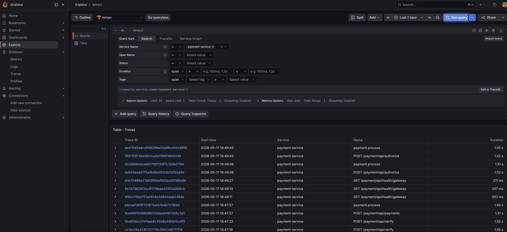
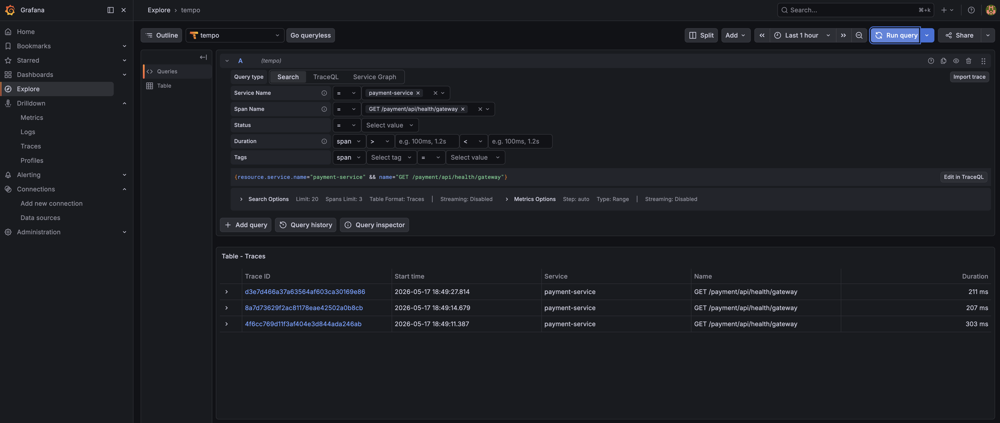
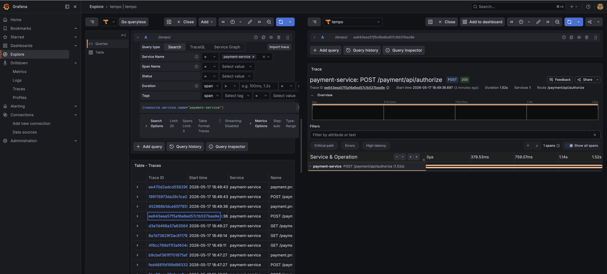
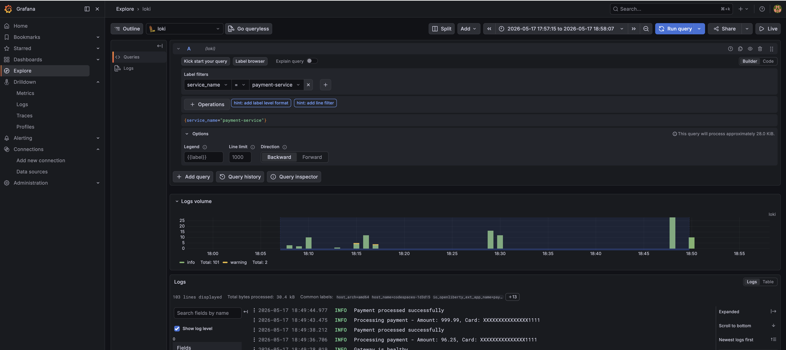

= Payment Service — MicroProfile Telemetry 2.1
:toc: macro
:toclevels: 3
:icons: font
:source-highlighter: highlight.js
:experimental:

toc::[]

This microservice demonstrates MicroProfile Telemetry 2.1 integrated with the LGTM observability stack (Loki, Grafana, Tempo, Prometheus) via an OpenTelemetry Collector. It is part of the Chapter 09 MicroProfile tutorial.

The service processes payments with full fault tolerance (retry, fallback, circuit breaker, bulkhead, timeout) and exports **traces**, **metrics**, and **logs** over OTLP to the LGTM stack.

== Architecture

----
 Payment Service (Open Liberty)
    │  MicroProfile Telemetry 2.1
    │  OTLP gRPC → port 24317 (Codespaces)
    ▼              port 4317  (local)
 OpenTelemetry Collector
    ├──► Tempo      (traces)  — port 14317 → Tempo:4317
    ├──► Loki       (logs)    — HTTP → Loki:3100/otlp
    └──► Prometheus (metrics) — scrape endpoint :8889
              │
              ▼
         Grafana (unified dashboard) — port 13000
----

== Prerequisites

* JDK 21 or higher
* Maven 3.9.0 or higher
* Docker and Docker Compose

== Project Structure

----
code/chapter09/
├── docker-compose.yml          # LGTM + OTel Collector stack
├── otel-collector-config.yml   # OTel Collector pipeline config
├── prometheus.yml              # Prometheus scrape config
├── tempo-config.yaml           # Grafana Tempo v3 config
└── payment/
    ├── pom.xml
    └── src/main/
        ├── java/io/microprofile/tutorial/store/payment/
        │   ├── entity/PaymentDetails.java
        │   ├── exception/
        │   ├── resource/PaymentResource.java   # REST endpoints
        │   └── service/PaymentService.java     # Business logic + telemetry
        ├── liberty/config/server.xml           # Open Liberty features
        └── resources/META-INF/
            └── microprofile-config.properties  # OTLP / sampler config
----

== LGTM Observability Stack

All observability infrastructure lives in `code/chapter09/`. Start from that directory.

=== docker-compose.yml

The stack exposes ports offset from the defaults to avoid conflicts in GitHub Codespaces:

[options="header"]
|===
|Service |Image |Host Port |Container Port |Purpose
|Grafana |grafana/grafana:latest |13000 |3000 |Unified dashboard
|Prometheus |prom/prometheus:latest |19090 |9090 |Metrics storage
|Loki |grafana/loki:latest |13100 |3100 |Log storage
|Tempo |grafana/tempo:latest |13200, 14317, 14318 |3200, 4317, 4318 |Trace storage
|OTel Collector |otel/opentelemetry-collector-contrib:latest |24317, 24318 |4317, 4318 |Telemetry gateway
|===

IMPORTANT: `dns_search: []` is set on every service. Without it, Docker's embedded DNS in GitHub Codespaces appends an Azure search domain (e.g. `gjgsbu0qvyie5dgfl5s3ewuwyc.ax.internal.cloudapp.net`) to short hostnames like `tempo`, causing `no such host` errors when Grafana tries to connect to its data sources.

[source,yaml]
----
version: '3.8'

services:
  grafana:
    image: grafana/grafana:latest
    container_name: grafana
    ports:
      - "13000:3000"
    environment:
      - GF_SECURITY_ADMIN_PASSWORD=admin
    volumes:
      - grafana-storage:/var/lib/grafana
    depends_on:
      - prometheus
      - loki
      - tempo
    dns_search: []
    networks:
      - observability

  prometheus:
    image: prom/prometheus:latest
    container_name: prometheus
    ports:
      - "19090:9090"
    volumes:
      - ./prometheus.yml:/etc/prometheus/prometheus.yml
      - prometheus-storage:/prometheus
    command:
      - '--config.file=/etc/prometheus/prometheus.yml'
      - '--storage.tsdb.path=/prometheus'
    dns_search: []
    networks:
      - observability

  loki:
    image: grafana/loki:latest
    container_name: loki
    ports:
      - "13100:3100"
    volumes:
      - loki-storage:/loki
    dns_search: []
    networks:
      - observability

  tempo:
    image: grafana/tempo:latest
    container_name: tempo
    ports:
      - "13200:3200"
      - "14317:4317"
      - "14318:4318"
    volumes:
      - tempo-storage:/var/tempo
      - ./tempo-config.yaml:/etc/tempo/tempo-config.yaml
    command: [ "-config.file=/etc/tempo/tempo-config.yaml" ]
    dns_search: []
    networks:
      - observability

  otel-collector:
    image: otel/opentelemetry-collector-contrib:latest
    container_name: otel-collector
    ports:
      - "24317:4317"
      - "24318:4318"
      - "19411:9411"
    volumes:
      - ./otel-collector-config.yml:/etc/otel-collector-config.yml
    command: [ "--config=/etc/otel-collector-config.yml" ]
    depends_on:
      - loki
      - prometheus
      - tempo
    dns_search: []
    networks:
      - observability

volumes:
  grafana-storage:
  prometheus-storage:
  loki-storage:
  tempo-storage:

networks:
  observability:
    driver: bridge
----

=== otel-collector-config.yml

The OTel Collector receives all three signals on OTLP ports and fans them out to the appropriate backend.

[source,yaml]
----
receivers:
  otlp:
    protocols:
      grpc:
        endpoint: 0.0.0.0:4317
      http:
        endpoint: 0.0.0.0:4318

processors:
  batch:
    timeout: 10s
    send_batch_size: 1024

exporters:
  debug:
    verbosity: detailed

  otlp_grpc/tempo:
    endpoint: tempo:4317
    tls:
      insecure: true

  otlp_http/loki:
    endpoint: http://loki:3100/otlp
    tls:
      insecure: true

  prometheus:
    endpoint: "0.0.0.0:8889"

service:
  pipelines:
    traces:
      receivers: [otlp]
      processors: [batch]
      exporters: [otlp_grpc/tempo, debug]

    metrics:
      receivers: [otlp]
      processors: [batch]
      exporters: [prometheus, debug]

    logs:
      receivers: [otlp]
      processors: [batch]
      exporters: [otlp_http/loki, debug]
----

NOTE: The `debug` exporter prints received telemetry to the collector's stdout. Use `docker compose logs otel-collector` to confirm data is flowing. Remove it in production to reduce noise.

=== tempo-config.yaml

Grafana Tempo v3 removed the top-level `ingester` field. Use this minimal v3-compatible configuration:

[source,yaml]
----
server:
  http_listen_port: 3200
  log_level: info

distributor:
  receivers:
    otlp:
      protocols:
        grpc:
          endpoint: 0.0.0.0:4317
        http:
          endpoint: 0.0.0.0:4318

storage:
  trace:
    backend: local
    wal:
      path: /var/tempo/wal
    local:
      path: /var/tempo/blocks
----

=== prometheus.yml

Prometheus scrapes itself and the OTel Collector's Prometheus exporter endpoint:

[source,yaml]
----
global:
  scrape_interval: 15s
  evaluation_interval: 15s

scrape_configs:
  - job_name: 'prometheus'
    static_configs:
      - targets: ['localhost:9090']

  - job_name: 'otel-collector'
    static_configs:
      - targets: ['otel-collector:8889']
----

== Payment Service Configuration

=== server.xml — Open Liberty Features

The service runs on the `microProfile-7.1` platform, which includes MicroProfile Telemetry 2.1:

[source,xml]
----
<server description="MicroProfile Tutorial Liberty Server">
    <featureManager>
        <platform>microProfile-7.1</platform>
        <platform>jakartaEE-10.0</platform>
        <feature>restfulWS</feature>
        <feature>jsonp</feature>
        <feature>jsonb</feature>
        <feature>cdi</feature>
        <feature>mpConfig</feature>
        <feature>mpOpenAPI</feature>
        <feature>mpHealth</feature>
        <feature>mpMetrics</feature>
        <feature>mpTelemetry</feature>
        <feature>mpFaultTolerance</feature>
    </featureManager>

    <httpEndpoint httpPort="${default.http.port}" httpsPort="${default.https.port}"
                  id="defaultHttpEndpoint" host="*" />
    <mpMetrics authentication="false"/>
    <webApplication location="payment.war" contextRoot="${app.context.root}"/>
</server>
----

=== microprofile-config.properties — Telemetry Settings

[source,properties]
----
# MicroProfile Telemetry Configuration
otel.service.name=payment-service
otel.sdk.disabled=false

# OTLP Exporter Configuration
# Use port 4317 locally; use port 24317 when running in GitHub Codespaces
otel.exporter.otlp.endpoint=http://localhost:24317
otel.traces.exporter=otlp
otel.metrics.exporter=otlp
otel.logs.exporter=otlp

# Sampling — always sample, respecting parent decision
otel.traces.sampler=parentbased_always_on
----

IMPORTANT: When running locally (not in Codespaces), change the endpoint to `http://localhost:4317` to match the OTel Collector's standard OTLP gRPC port. In Codespaces the host port is `24317`.

== Code Implementation

=== PaymentService.java — CDI Telemetry Injection

MicroProfile Telemetry 2.1 exposes `Tracer` and `Meter` as CDI beans. Inject them directly — do not use `GlobalOpenTelemetry.get*()`:

[source,java]
----
@ApplicationScoped
public class PaymentService {

    @Inject
    Tracer tracer;           // io.opentelemetry.api.trace.Tracer

    @Inject
    Meter meter;             // io.opentelemetry.api.metrics.Meter

    private LongCounter paymentAttemptsCounter;

    @PostConstruct
    public void init() {
        paymentAttemptsCounter = meter
                .counterBuilder("payment.attempts")
                .setDescription("Number of payment attempts by result")
                .setUnit("1")
                .build();
    }
}
----

NOTE: The `Meter` is used in `@PostConstruct` to build instruments — not in `init()` directly on the `Tracer`, which is used per-request. Building instruments in `@PostConstruct` ensures they are registered once at startup.

=== Manual Span Creation

The `processPayment` method creates a child span with business attributes:

[source,java]
----
@Asynchronous
@Timeout(3000)
@Retry(maxRetries = 3, delay = 2000, jitter = 500,
       retryOn = PaymentProcessingException.class,
       abortOn = CriticalPaymentException.class)
@Fallback(fallbackMethod = "fallbackProcessPayment")
@Bulkhead(value = 5)
public CompletionStage<String> processPayment(PaymentDetails paymentDetails)
        throws PaymentProcessingException {

    Span span = tracer.spanBuilder("payment.process")
            .setAttribute("payment.amount", paymentDetails.getAmount().toString())
            .setAttribute("payment.method", "credit_card")
            .setAttribute("payment.service", "payment-service")
            .startSpan();

    try (Scope scope = span.makeCurrent()) {
        span.setAttribute("payment.status", "IN_PROGRESS");
        span.addEvent("Starting payment processing");

        // ... business logic ...

        paymentAttemptsCounter.add(1,
            Attributes.of(AttributeKey.stringKey("result"), "success"));
        span.setAttribute("payment.status", "SUCCESS");
        span.setStatus(StatusCode.OK);
        span.addEvent("Payment processed successfully");
        return CompletableFuture.completedFuture("{\"status\":\"success\",...}");
    } finally {
        span.end();
    }
}
----

The `payment.attempts` counter is incremented with a `result` attribute on every outcome: `success`, `failed`, or `fallback`. This enables per-outcome metrics in Prometheus.

=== Circuit Breaker — checkGatewayHealth

[source,java]
----
@CircuitBreaker(requestVolumeThreshold = 4, failureRatio = 0.75,
                delay = 1000, successThreshold = 2)
public boolean checkGatewayHealth() {
    // Simulates a network call to the payment gateway
    simulateNetworkCall(200);
    if (Math.random() > 0.9) {
        throw new RuntimeException("Payment gateway not responding");
    }
    return true;
}
----

=== Async Notification — sendPaymentNotification

[source,java]
----
@Asynchronous
@Bulkhead(5)
public CompletionStage<String> sendPaymentNotification(
        String paymentId, String recipient) {
    simulateNetworkCall(300);
    return CompletableFuture.completedFuture(
            "Notification sent to " + recipient + " for payment " + paymentId);
}
----

== API Endpoints

Base URL: `http://localhost:9080/payment`

[options="header"]
|===
|Method |Path |Description |Fault Tolerance
|POST |`/authorize?amount={value}` |Process payment by amount |`@Retry`, `@Fallback`, `@Bulkhead`, `@Timeout`, `@Asynchronous`
|POST |`/payments` |Process payment with full card details |`@Retry`, `@Fallback`, `@Bulkhead`, `@Timeout`, `@Asynchronous`
|POST |`/verify` |Verify payment — runs validation, fraud check, funds check |`@Asynchronous`
|GET |`/health/gateway` |Check gateway health |`@CircuitBreaker`
|POST |`/notify/{paymentId}?recipient={email}` |Send async payment notification |`@Asynchronous`, `@Bulkhead`
|===

OpenAPI UI: http://localhost:9080/openapi/ui/

=== PaymentDetails request body

Used by `POST /payments` and `POST /verify`:

[source,json]
----
{
  "cardNumber":     "4111111111111111",
  "cardHolderName": "Test User",
  "expiryDate":     "12/25",
  "securityCode":   "123",
  "amount":         99.99
}
----

NOTE: Card numbers ending in `0000` trigger a fraud-check failure in the verification flow. Amounts above `1000` trigger an insufficient-funds failure.

== Building and Running

=== Step 1 — Start the LGTM observability stack

Open a terminal and run from the `code/chapter09/` directory:

[source,bash]
----
cd code/chapter09
docker compose up -d
docker compose ps
----

Expected: all five services (`grafana`, `prometheus`, `loki`, `tempo`, `otel-collector`) show status `running`.

Verify each backend is healthy:

[source,bash]
----
curl -s http://localhost:13200/ready     # Tempo  → "ready"
curl -s http://localhost:13100/ready     # Loki   → "ready"
curl -s http://localhost:19090/-/healthy # Prometheus → "Prometheus Server is Healthy."
----

=== Step 2 — Configure Grafana data sources

Open Grafana at http://localhost:13000 (login: `admin` / `admin`).

Go to *Connections → Data sources → Add data source* and add:

[options="header"]
|===
|Type |Name |URL
|Prometheus |Prometheus |`http://prometheus:9090`
|Loki |Loki |`http://loki:3100`
|Tempo |Tempo |`http://tempo:3200`
|===

Click *Save & test* for each. All three should show a success message.

NOTE: Use the Docker service names (`prometheus`, `loki`, `tempo`) as hostnames — not `localhost`. Grafana runs inside the same Docker network as the backends, so service-name DNS resolution works.

=== Step 3 — Build and start the payment service

Open a second terminal from the `code/chapter09/payment/` directory:

[source,bash]
----
cd code/chapter09/payment
mvn clean package
mvn liberty:run
----

Wait for the message:

----
[AUDIT] CWWKF0011I: The server mpServer is ready to run a smarter planet.
----

The service is now available at http://localhost:9080/payment.

=== Step 4 — Generate telemetry traffic

Run the following to exercise all telemetry paths:

[source,bash]
----
# 1. Simple authorize (retry + fallback path)
curl -s -X POST "http://localhost:9080/payment/authorize?amount=75.50"

# 2. Full payment with card details (creates payment.process span)
curl -s -X POST "http://localhost:9080/payment/payments" \
  -H "Content-Type: application/json" \
  -d '{"cardNumber":"4111111111111111","cardHolderName":"Test User","expiryDate":"12/25","securityCode":"123","amount":99.99}'

# 3. Verification flow (validation → fraud check → funds check sub-spans)
curl -s -X POST "http://localhost:9080/payment/verify" \
  -H "Content-Type: application/json" \
  -d '{"cardNumber":"4111111111111111","cardHolderName":"Test User","expiryDate":"12/25","securityCode":"123","amount":150.00}'

# 4. Trigger fraud check failure (card ending 0000)
curl -s -X POST "http://localhost:9080/payment/verify" \
  -H "Content-Type: application/json" \
  -d '{"cardNumber":"4111111110000","cardHolderName":"Test User","expiryDate":"12/25","securityCode":"123","amount":50.00}'

# 5. Gateway health check (circuit breaker path)
curl -s "http://localhost:9080/payment/health/gateway"

# 6. Async notification
curl -s -X POST "http://localhost:9080/payment/notify/PAY-12345?recipient=ops@example.com"
----

Run each command several times to produce enough data for Grafana to display.

== Verifying Telemetry in Grafana

=== Traces in Tempo

1. Open Grafana → *Explore* → select *Tempo*
2. Switch to the *Search* tab
3. Set *Service Name* = `payment-service`
4. Click *Run query*

You should see recent traces. Click any trace to expand the span tree. Look for:

* Root HTTP span: `POST /payment/payments` or `POST /payment/verify`
* Child span: `payment.process` with attributes `payment.amount`, `payment.method`, `payment.status`
* For the verify flow: `validatePaymentDetails`, `performFraudCheck`, `verifyFundsAvailability`, `recordTransaction` steps appear as log events on the span

The following screenshot shows all payment-service traces listed in Tempo after generating traffic:

You can filter by span name (e.g. `GET /payment/api/health/gateway`) to narrow down traces for a specific endpoint:

Click any row to open the trace detail panel. The example below shows the full span tree for a `POST /payment/api/authorize` request:

=== Logs in Loki

The following screenshot shows Loki logs for the payment-service, including the log volume histogram and individual log lines with `traceId` links back to Tempo:

1. Open Grafana → *Explore* → select *Loki*
2. Enter one of these LogQL queries:
+
[source]
----
{exporter="OTLP"}
----
+
or filter by service:
+
[source]
----
{service_name="payment-service"}
----
+
3. Look for log lines that contain `traceId` — click the trace link to jump directly to the correlated trace in Tempo.

=== Metrics in Prometheus

The following screenshot shows the `payment_attempts_total` counter plotted over time, broken down by `result` label (`failed` and `success`):

image::..../images/grafana-prometheus-payment-attempts-metric.png[Grafana Prometheus — payment_attempts_total metric time series by result label,role="related thumb right"]

1. Open Grafana → *Explore* → select *Prometheus* (or use http://localhost:19090 directly)
2. Query the custom payment counter:
+
[source]
----
payment_attempts_total
----
+
3. Break it down by result label:
+
[source]
----
payment_attempts_total{result="success"}
payment_attempts_total{result="failed"}
payment_attempts_total{result="fallback"}
----
+
4. Also query HTTP server metrics emitted automatically by MicroProfile Telemetry:
+
[source]
----
http_server_request_duration_seconds_count
----
+
5. Fault tolerance metrics from MicroProfile Fault Tolerance:
+
[source]
----
ft_retry_calls_total
ft_circuitbreaker_state_total
ft_bulkhead_calls_total
----

== Troubleshooting

=== Payment service cannot reach OTel Collector

Symptom in Liberty logs:

----
Failed to export logs. The request could not be executed.
Failed to connect to localhost/[0:0:0:0:0:0:0:1]:24317
----

Cause: The `otel.exporter.otlp.endpoint` in `microprofile-config.properties` points to the wrong port.

Fix: In GitHub Codespaces use port `24317`; locally use `4317`:

[source,properties]
----
# Codespaces
otel.exporter.otlp.endpoint=http://localhost:24317

# Local Docker
otel.exporter.otlp.endpoint=http://localhost:4317
----

=== Grafana data source "Failed to connect to Tempo/Loki/Prometheus"

Symptom:

----
Get "http://tempo:3200/api/echo": dial tcp: lookup tempo on 127.0.0.11:53: no such host
----

Cause: GitHub Codespaces injects an Azure DNS search domain. Docker's embedded DNS (127.0.0.11) appends it to short names like `tempo`, producing an NXDOMAIN.

Fix: The `docker-compose.yml` already sets `dns_search: []` on every service to suppress the search domain. If you see this error, ensure you are using the latest `docker-compose.yml` and recreate all containers:

[source,bash]
----
cd code/chapter09
docker compose down
docker compose up -d
----

=== Tempo container exits immediately

Symptom in `docker compose logs tempo`:

----
field ingester not found in type app.Config
----

Cause: Tempo v3 removed the `ingester` top-level key. Ensure `tempo-config.yaml` does not contain an `ingester:` section. The configuration in this repo is already v3-compatible.

=== Loki container exits immediately

Symptom in `docker compose logs loki`:

----
/etc/loki/local-config.yml does not exist
----

Cause: An override `command:` was pointing to a `.yml` file but the image default uses `.yaml`. The `docker-compose.yml` in this repo does not override the Loki command, so the image default applies and the container starts correctly.

=== No traces appear in Tempo

1. Confirm the OTel Collector is receiving data:
+
[source,bash]
----
docker compose logs --tail=30 otel-collector
----
+
You should see `ResourceSpans` logged by the `debug` exporter.

2. Confirm `otel.sdk.disabled=false` in `microprofile-config.properties`.

3. Confirm the service restarted after the config change:
+
[source,bash]
----
# Stop (Ctrl+C in the mvn liberty:run terminal), then restart
mvn liberty:run
----

== Clean Up

[source,bash]
----
# Stop the payment service (Ctrl+C in the mvn liberty:run terminal)
mvn liberty:stop

# Stop and remove all LGTM containers and volumes
cd code/chapter09
docker compose down -v
----

== Related Resources

* https://microprofile.io/specifications/microprofile-telemetry/[MicroProfile Telemetry 2.1 Specification]
* https://opentelemetry.io/docs/[OpenTelemetry Documentation]
* https://grafana.com/docs/tempo/[Grafana Tempo]
* https://grafana.com/docs/loki/[Grafana Loki]
* https://openliberty.io/docs/latest/microprofile-telemetry.html[Open Liberty MicroProfile Telemetry]
